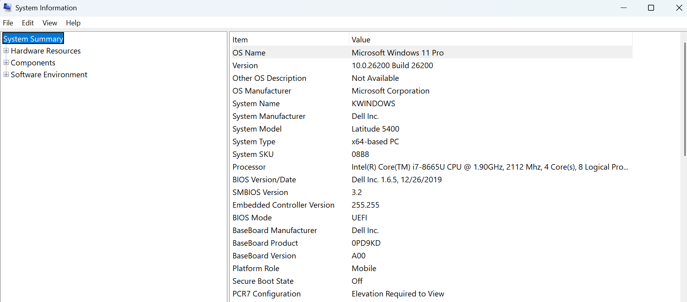

# Day 1 Lab – Hardware Assessment

**Lab ID:** LAB-0001

**Date:** June 29, 2026

**Technician:** Md Wara

**Department:** Information Technology

---

# Objective

Learn how to identify hardware specifications and use built-in Windows tools to gather system information for troubleshooting and inventory purposes.

---

# Lab 1 – System Information (msinfo32)

## Tool Used

* System Information (msinfo32)

## Information Collected

| Item          | Value |
| ------------- | ----- |
| Manufacturer  |  Dell Inc.     |
| Model         |  Latitude 5400     |
| Processor     |  Intel(R) Core(TM) i7-8665U Cpu @ 1.90GHz     |
| Installed RAM |    32.0 GB   |
| BIOS Version  |   Dell Inc. 1.6.5, 12/26/2019   |

**Screenshot:** 

---

# Lab 2 – Task Manager

## Tool Used

* Task Manager → Performance

### Observations

| Component | Observation |
| --------- | ----------- |
| CPU       |     7%        |
| Memory    |     30%        |
| Disk      | SSD    |
| GPU       |     1%        |

**Screenshot:** `images/day-01/task-manager-performance.png`

---

# Lab 3 – Device Manager

## Tool Used

* Device Manager

### Hardware Categories Reviewed

* Display adapters
* Disk drives
* Network adapters
* Processors

### Notes

**Screenshot:** `images/day-01/device-manager.png`

---

# Lessons Learned

* Learned how to locate hardware information using Windows tools.
* Learned where to identify installed hardware devices.
* Understood how these tools assist in troubleshooting and asset management.

---

# Conclusion

The system hardware was successfully reviewed using built-in Windows administration tools. The collected information will support future inventory management and troubleshooting activities.
