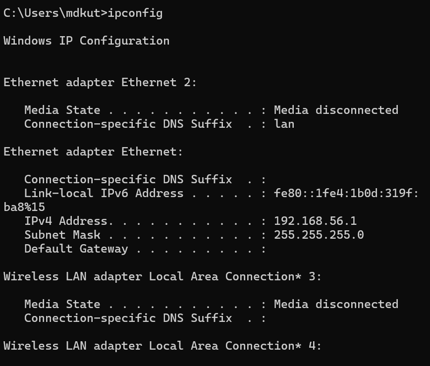
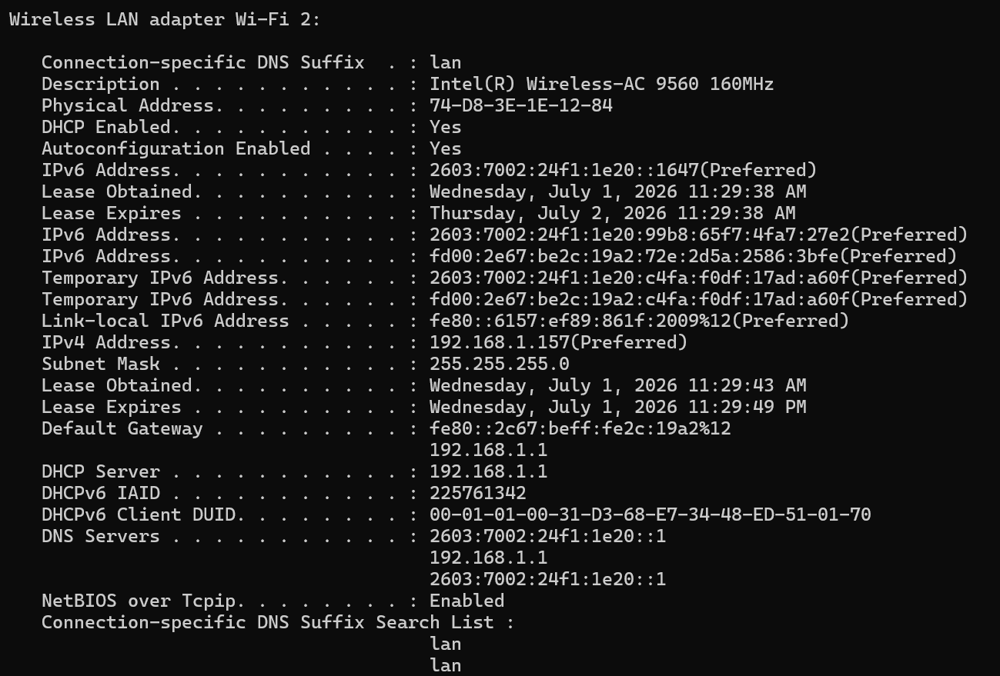
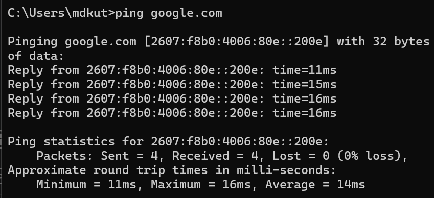
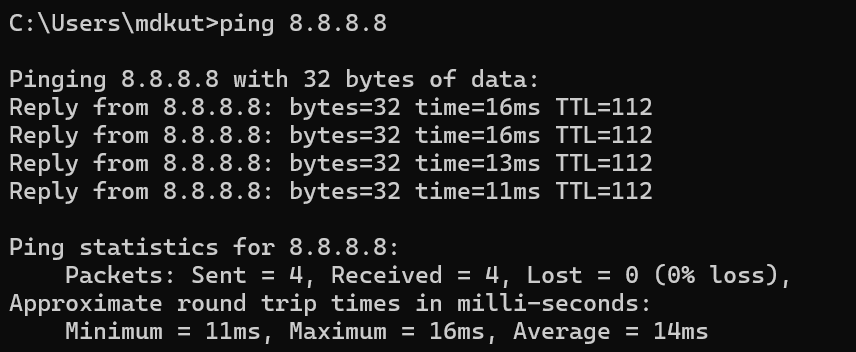
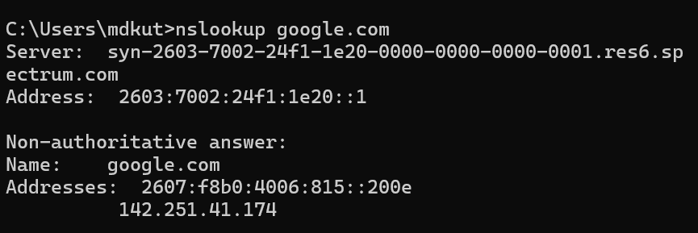
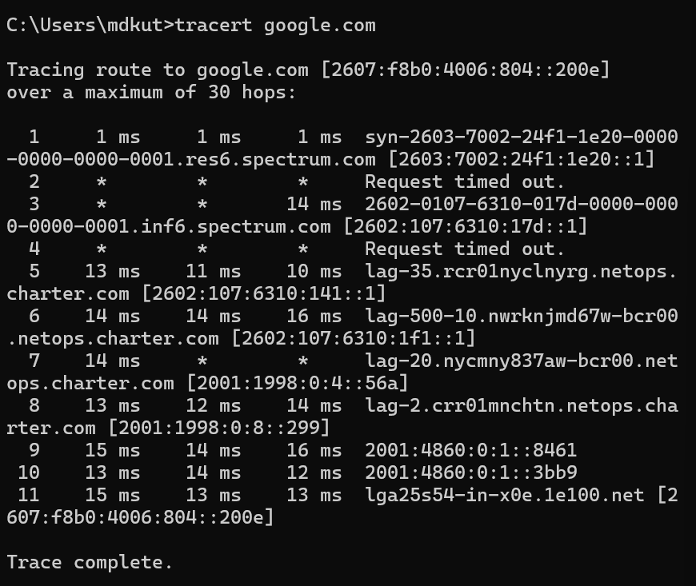

# Day 3 Lab – Network Connectivity Fundamentals

**Lab ID:** LAB-0003

**Date:** July 1, 2026

**Technician:** Kutbul Wara

**Department:** Information Technology

---

# Objective

The objective of this lab was to understand the fundamental networking tools used by IT Support Specialists to diagnose and troubleshoot network connectivity issues. The lab focused on collecting IP configuration information, testing network connectivity, verifying DNS resolution, and tracing network paths using built-in Windows networking commands.

---

# Lab 1 – IP Configuration

## Tool Used

- Command Prompt
- `ipconfig`

## Information Collected

| Item | Value |
|------|------|
| IPv4 Address | 192.168.1.157 |
| Subnet Mask | 255.255.255.0 |
| Default Gateway | 192.168.1.1 |

### Observations

- The computer successfully obtained a private IPv4 address from the local network.
- The subnet mask indicates the device belongs to a standard Class C private network.
- The default gateway points to the local router, which provides internet access for devices on the network.

### Screenshot

---

# Lab 2 – Detailed Network Configuration

## Tool Used

- Command Prompt
- `ipconfig /all`

## Information Collected

| Item | Value |
|------|------|
| Computer Name | KWindows |
| Physical Address (MAC) | 74-D8-3E-1E-12-84 |
| DHCP Enabled | Yes |
| DNS Server | 192.168.1.1 |

### Observations

- DHCP is enabled, allowing the computer to automatically receive network settings from the router.
- The physical (MAC) address uniquely identifies the network adapter.
- The local router is acting as the DNS server for the workstation.

### Screenshot

---

# Lab 3 – Ping Test (google.com)

## Tool Used

- Command Prompt
- `ping google.com`

## Test Results

| Item | Value |
|------|------|
| Packets Sent | 4 |
| Packets Received | 4 |
| Packets Lost | 0 |
| Average Response Time | 14 ms |

### Observations

- All packets were successfully transmitted and received.
- Zero packet loss indicates a stable internet connection.
- DNS successfully resolved the domain name before the ping request was sent.

### Screenshot

---

# Lab 4 – Ping Test (8.8.8.8)

## Tool Used

- Command Prompt
- `ping 8.8.8.8`

## Test Results

| Item | Value |
|------|------|
| Packets Sent | 4 |
| Packets Received | 4 |
| Packets Lost | 0 |
| Average Response Time | 14 ms |

### Observations

- Direct communication with Google's public DNS server was successful.
- Successful responses confirm that internet connectivity is functioning correctly.
- Comparing this result with `ping google.com` helps distinguish between connectivity issues and DNS-related issues.

### Screenshot

---

# Lab 5 – DNS Lookup

## Tool Used

- Command Prompt
- `nslookup google.com`

## Information Collected

| Item | Value |
|------|------|
| DNS Server | syn-2603-7002-24f1-1e20-0000-0000-0000-0001.res6.spectrum.com |
| DNS Server Address | 2603:7002:24f1:1e20::1 |
| Google IP Addresses | 2607:f8b0:4006:815::200e (IPv6) 142.251.41.174 (IPv4) |

### Observations

- DNS resolution completed successfully.
- The ISP's DNS server translated the domain name into both IPv6 and IPv4 addresses.
- The presence of both address types demonstrates that the network supports dual-stack (IPv4 and IPv6) networking.

### Screenshot

---

# Lab 6 – Trace Route

## Tool Used

- Command Prompt
- `tracert google.com`

## Information Collected

| Item | Value |
|------|------|
| Trace Completed | Yes |
| Total Hops Displayed | 11 |
| First Hop | Spectrum Router (2603:7002:24f1:1e20::1) |
| Final Destination | lga25s54-in-x0e.1e100.net (Google) |

### Observations

- The trace route completed successfully from the local computer to Google's servers.
- Eleven network hops were required to reach the destination.
- The first hop was the local ISP gateway, while the final hop reached Google's infrastructure.

### Screenshot

---

# Lessons Learned

- `ipconfig` provides essential network configuration information used during troubleshooting.
- DHCP automatically assigns network settings, eliminating the need for manual configuration.
- `ping` verifies network connectivity and can help identify connectivity issues.
- `nslookup` confirms whether DNS is functioning correctly.
- `tracert` identifies the network path taken to reach a destination and can help locate where communication problems occur.
- Comparing `ping google.com` with `ping 8.8.8.8` is an effective method for distinguishing DNS problems from general internet connectivity issues.

---

# Troubleshooting Decision

## Scenario

If `ping google.com` failed but `ping 8.8.8.8` succeeded, I would suspect a DNS resolution issue because internet connectivity exists but domain names cannot be translated into IP addresses.

My next step would be to verify the configured DNS server using `ipconfig /all` and test DNS resolution using `nslookup`.

---

# Business Impact

Understanding and using networking diagnostic tools enables IT Support Specialists to quickly identify the source of connectivity issues, reducing downtime and restoring employee productivity. Efficient network troubleshooting minimizes business disruptions and improves overall IT service quality.

---

# Conclusion

This lab provided practical experience using Windows networking tools commonly utilized by IT Support Specialists. By collecting network configuration information, testing connectivity, verifying DNS resolution, and tracing network paths, I developed a structured approach to diagnosing network-related issues. These skills form the foundation for troubleshooting internet connectivity, DNS problems, and communication failures in an enterprise environment.